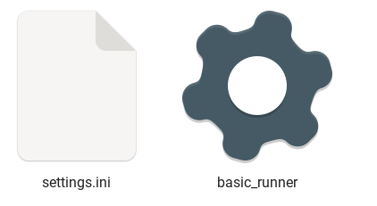
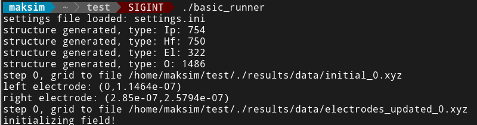
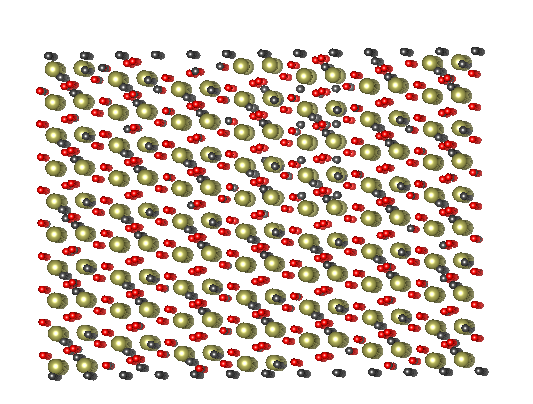

# Инструкция к программе flow

**Соловьёв Максим Андреевич**

## Состав

Программа состоит из нескольких частей:

- Основная библиотека, реализующая ключевые функции (в папке scr, проект **flow**)
- Программа-запускатор (**brunner**). Программа используется для запуска конкретной конфигурации системы и работы с настройками.
- Программа для тестов (в основном основной библиотеки) **flowtest**. Содержит набор тестов для того, чтобы удостоверится, что осоновные компоненты системы работают.

## Компиляция

### Требования

- Компилятор **GCC** желательно версси GCC 10 и выше
- Система сборки **CMake** версии 3.11 и выше.
- Для первой компиляции требуется подключение интернета для загрузки необходимых библиотек.

## Использование

Для запуска программы требуется:

- Сама скомпилированная программа
- Файл настроек (см. **settings.ini**)

Программа использует файл настроек из рабочей папки.

Для запуска - просто запустить программу, верно указав рабочую папку. Консольных аргументов нет.

В процессе работы программа создаст папку для сохранения результатов.

Выходные структуры записыватся в формате ".xyz" и могут быть просмотрены, например, с помощью VESTA (https://jp-minerals.org/vesta/en/)

